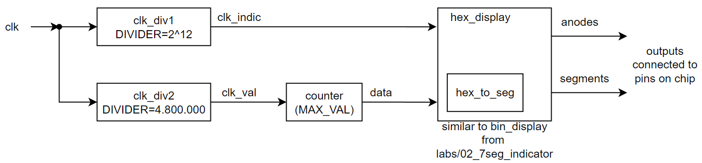

# Hex Timer

## По поводу параметров и стандартов Verilog

Quartus поддерживает только стандарт Verilog 2001.
Синтаксис создания модуля с параметрами который мы рассматривали относится к стандарту Verilog 2005. В стандарте Verilog 2001 параметры переопределяются не с помощью =, а в стиле похожем на входы/выходы.

```
Verilog 2001 Example:
clk_div #(.DIVIDER(4096)) clk_div_indicator (.clk_in(...), .clk_out(...));

verilog 2005 Example:
clk_div #(DIVIDER = 4096) clk_div_indicator (.clk_in(...), .clk_out(...));
```

## Задание

Создать модуль, который будет считать от 0 до заданного параметром значения MAX_VAL, увеличивая значение каждые 0.1 сек. Текущее значение счетчика модуль должен выводить на семисегментный индикатор в hex формате.

Далее предлагается структура проекта, для которой приготовлен шаблон. Ее не обязательно придерживаться и если есть желание что то сделать лучше, то это приветствуется.

## Структура модуля


Основной модуль hex_display так же как и bin_display в labs/02_7seg_indicator выполняет декодирование значение data в маску светящихся/несветящихся сегментов и выполняет динамическую индикацию.  
**Дополните модуль hex_to_seg. Требуется добавить недостающие случаи.**

```
module hex_to_seg(
    input [3:0] data,

    output reg [6:0] segments
);

always @(*) begin
    case (data)          /* abcdefg */
        4'h0: segments = 7'b1111110;
        4'h1: segments = 7'b0110000;
        /*
        *   Write logic for missing digits (0x2-0xE) here.
        */
        4'hF: segments = 7'b1000111;
    endcase
end

endmodule
```

**Дополните модуль hex_display. Необходимо дописать логику динамической индикации.**

```
module hex_display(
    input clk,
    input [15:0] data,

    output [3:0] anodes,
    output [6:0] segments
);

/*
*   Write logic for dynamic indication here.
*/

hex_to_seg hex_to_seg(.data(b), .segments(segments));

endmodule
```

Так же как и в лабораторной нам понадобится делитель частоты для выполнения динамической индикации и реализации счетчика с частотой переключения 0.1 сек.  
**Допишите модуль clk_div. Данный модуль принимает на вход clk_in и выдает на выход clk_out с частотой freq(clk_in/DIVIDER). За пример можете взять clk_div из 02_7seg_indicator и добавить к нему поддержку параметра DIVIDER.**

```
module clk_div #(
	parameter DIVIDER = 2
)(
	input clk_in,
	output clk_out
);

	localparam BW_CNT = $clog2(DIVIDER);
	reg [BW_CNT-1: 0] cnt;
	/*
	* counter code and connect input/output
	*/

endmodule
```

Модуль counter представляет собой счетчик, который считает от 0 до MAX_VAL. А так же разрядность его выхода задается параметром BW_VAL. Данный модуль очень похож на clk_div. При желании можно для всех задач написать один модуль.
**Дополните модуль counter.**

```
module counter #(
	parameter BW_VAL = 16,
	parameter MAX_VAL = 2
)(
	input clk,
	output [BW_VAL-1: 0] val
);

reg [BW_VAL-1: 0] cnt;

/*
*	counter code and input/output connection
*/

endmodule
```

Модуль top собирает финальный модуль, изображенный на схеме. Основной модуль hex_display - драйвер семисегментного индикатора. его вход clk подключен к выходу модуля clk_div1(DIVIDER=4096) т.к. для индикации нужна пониженная частота. Вход data подключен к выходу счетчика counter(MAX_VAL, BW_VAL=16).

Данный счетчик должен переключаться раз в 0.1 сек. Соответственно потребуется еще один делитель частоты clk_div2(DIVIDER=4.800.000).  
Почему DIVIDER=4.800.000? Данный ответ верен только для одного вида плат которые выдавались, для второй платы данное значение должно быть другим.  
**Найдите в документации на плату [1](../../docs/3-EASY%20FPGA%20Development%20Board%20Users%20Manual.pdf)/[2](../../docs/AX301_English_ug_V1.0.pdf) ответ.**

**Дополните код модуля top. Создайте все необходимые модули и соедените их между собой и ко входам/выходами.**

```
module top #(
	parameter MAX_VAL = 16'hffff // you can set it as you wish
)(
    input CLK,

    output DS_EN1, DS_EN2, DS_EN3, DS_EN4,
    output DS_A, DS_B, DS_C, DS_D, DS_E, DS_F, DS_G
);


wire [3:0] anodes;
assign {DS_EN1, DS_EN2, DS_EN3, DS_EN4} = ~anodes;

wire [6:0] segments;
assign {DS_A, DS_B, DS_C, DS_D, DS_E, DS_F, DS_G} = segments; // for some boards you should invert segments (~segments)

/*
*  Make an instance of clock divider that will drive dynamic indication
*/

/*
*	Make another instance of clock divider that will drive counter with required frequency
*/

/*
*	Make instance of counter that will count up to MAX_VAL increasing it's value every 0.1 sec
*/

/*
*   Make an instance of hex display driver (hex_display) here.
*   Connect 'anodes', 'segments', 'data' to corresponding wires in current
*   module.
*/

endmodule
```

## Симуляция и прошивка.

Просимулируйте и прошейте устройство, проверьте что все работает как и предполагалось.
