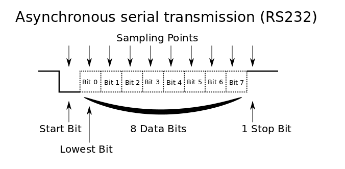
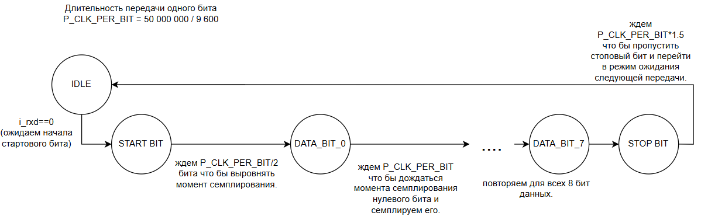
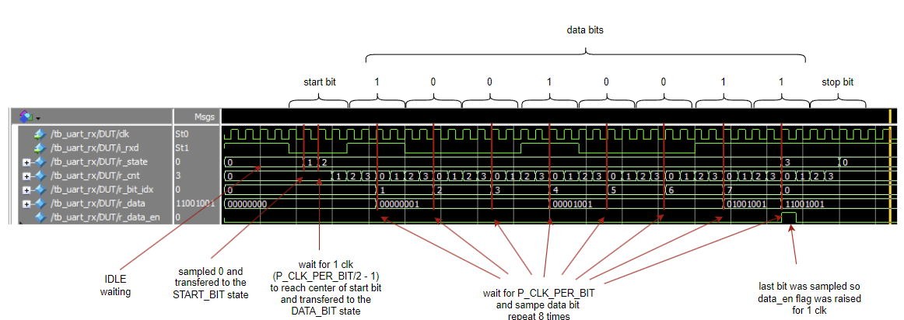

# UART loopback

В данной лабораторной требуется написать UART приемник. 
Имея приемник и передатчик можно сделать loopback. 
Тоесть с помощью приемника принимаем сообщение и сразу отправляем его обратно через передатчик.

## UART приемник

Простейший алгоритм приема следующий.  
(P_CLK_PER_BIT = 50 000 000 / 9 600 - длительность передачи одного бита) 
1. Ожидаем стартового бита.
2. Выжидаем P_CLK_PER_BIT/2 чтобы семплировать данные посередине.
3. 8 раз производим следующие действия:  
    3.1 ожидаем P_CLK_PER_BIT чтобы дождаться момента когда надо семплировать следующий бит.
    3.2 семплируем значение очередного бита.
4. ждем P_CLK_PER_BIT для того, что бы пропустить стоповый бит.

Данный алгорити на FPGA представляет собой машину состояний.
у нас есть следующие состояния:
1. IDLE - состояние в котором мы ожидаем начала следующей передачи (стартового бита)
2. START_BIT - состояние в котором мы ожидаем P_CLK_PER_BIT/2 что бы выровнять момент семплирования в центр стартового бита.
3. DATA_BIT_X - состояние в котором мы ожидаем момента семплирования бита под номером X и затем его семплируем.
4. STOP_BIT - состояние в котором мы ожидаем P_CLK_BIT что бы дождаться окончание передачи.

Можно было бы закодировать состояние в один регистр (reg [3: 0] r_state), но более логично и удобно использовать 2 регистра:
1. reg [1: 0] r_state, который кодирует состояния (PS - parameter state просто пббревиатура)  
    1.1 PS_IDLE  
    1.2 PS_START_BIT  
    1.3 PS_DATA_BIT - обьединяет состояния приема всех 8ми битов данных   
    1.4 PS_STOP_BIT
2. reg [2: 0] r_bit_idx; - индекс принимаемого бита. Используется что бы отличить состояния принимаемых битов когда r_state==PS_DATA_BIT.

Разберите каким образом реализуется машина состояний в файле uart_rx.v и реализуйте недостающую часть (Можно отходить от шаблона если есть другие идеи для реализации).  
  
У модуля есть входы/выходы
1. clk
2. i_rxd - пересинхронизированный вход rx.
3. o_data - на данный выход должны подаваться полученные данные.
4. o_data_en - на данном выходе генерируется импульс когда был до конца получен очередной байт. (этот импульс говорит всей остальной схеме в какой момент нужно читать данные с выхода o_data).

## Симуляция UART rx

Напишите небольшую симуляцию для демонстрации работы получившегося UART RX модуля.
Для удобства в симуляции можно создать модуль с значением параметра P_CLK_PER_BIT=4.
Результат симуляции должен выглядеть следующим образом.
В данной симуляции передается байт 8'b11001001

## UART loopback

Дополните модуль uart_loopback.v  
Модуль будет использовать uart_rx для приема данных и uart_tx для отправки их же обратно. 

Теперь если вы прошьете FPGA и подключите ее к PC, то когда вы будете что то печатать в putty, то в терминале должны появляться те символы, которые вы печатаете. При нажатии клавиши в терминале putty, putty ничего сам не печатает на экране, а просто отправляет байт содержащий необходимый символ по uart. На экране putty выводит только сообщения которые отправляет FPGA. Поэтому так как наш модуль uart_loopback получает отправленный компьютером байт и отправляет его обратно, то на экране мы видим символ, который ввели с клавиатуры (если все работает правильно).