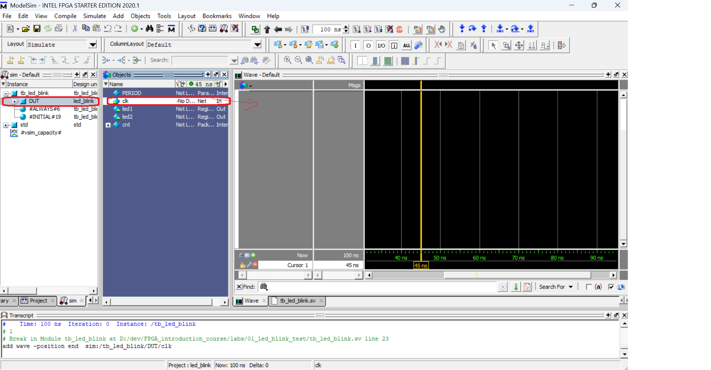

# Простейший проект моргающего диода

## Симуляция в ModelSim (можно использовать любой альтернативный симулятор)

* Создаем новый проект File -> New Project (выберите labs/01_led_blink_test в качестве директории проекта).
* Заполните имя проекта (Любое, но логично будет выбрать led_blink по названию топ модуля).
* Добавьте файлы проекта (Add Existing File [led_blink.v, tb_led_blink.sv])
* Перед симуляцией файлы необходимо скомпилировать Compile->Compile All. Если при разработке вы будете менять какие то файлы, то их можно перекомпилировать отдельно.
* Запустите симуляцию: 
    * Simulate->Start simulation
    * выберите модуль тестбенча (work->tb_led_blink)
* Добавьте все необходимые сигналы в панель Wave (пример с добавлением clk)

* Запустите симуляцию

* В итоге вы должны увидеть результат симуляции в виде Waveform

## Проект в Quartus

### Создание проекта
* New Project Wizard
* Directory, Name, Top-Level Entity
    * Directory: выберите labs/01_led_blink_test в качестве директории проекта.
    * Project Name: led_blink (Название проекта можно выбрать любым, но лучше тем же что и top-level entity)
    * Top-Level Entity: led_blink (Так как модуль в данном проекте назван led_blink в файле led_blink.v).
*  Project Type
    *  Empty project
*  Add Files
    *  Добавьте файл led_blink.v
*  Device
    *  Выберите свое устройство. Свою модель можно посмотреть на чипе (либо EP4CE6E22C8 либо EP4CE6F17I7). Также Device можно выбрать позже из меню Assignments->Device...
*  Далее Next до конца.
### Синтез проекта
* Запустите Синтез 
* После синтеза можно будет посмотреть отчеты и ошибки/предупреждения.
### RTL Viewer
После синтеза можно посмотреть в какую схему преобразовался ваш код. Для этого надо зайти в Tools->Netlist Viewer->RTL Viewer. 

### Pin assignment
Необходимо ассоциировать порты (входы/выходы) модуля верхнего уровня (Top level entity) с физическими пинами чипа.  
Для этого необходимо знать разводку платы. Для этого нужна документация на плату.  
Для чипа EP4CE6E22C8 - [schematic](https://github.com/BusseAA/FPGA_introduction_course/blob/main/docs/schematic_v200.pdf).  
Для чипа EP4CE6F17I7 - [User manual](https://github.com/BusseAA/FPGA_introduction_course/blob/main/docs/AX301_English_ug_V1.0.pdf).  
* Откройте окно Pin Planer (Assignments->Pin Planer). Там на нижней панели вы должны увидеть список портов топ модуля (список будет пуст если вы не запускали синтез и его можно заполнить впустую, но проще запустить синтез после которого они появятся).
* Добавьте ассоциации для входов/выходов модуля led_blink (Найдите в документации почему были выбраны именно эти пины).
  * clk
    * Node Name: clk
    * Location: EP4CE6E22C8 - PIN_24 / EP4CE6F17I7 - PIN_E1
  * led1
    * Node Name: led1
    * Location: EP4CE6E22C8 - PIN_2 / EP4CE6F17I7 - PIN_E10
  * led2
    * Node Name: led2
    * Location: EP4CE6E22C8 - PIN_3 / EP4CE6F17I7 - PIN_F9

чуть больше о pin planner можно почитать [тут](https://robotclass.ru/articles/fpga-quartus-pin-planner/) или обо всех возможностя в документации на чип [тут](../../docs/cyclone4-handbook.pdf)

### Timing constraints
Последнее что мы забыли это задать то на какой частоте работает наше устройство.
* Создаем *.sdc файл File->New->Synopsys design constraints
* записываем в него следующий код
```
create_clock -period 50MHz -name clk [get_ports clk]
derive_pll_clocks
derive_clock_uncertainty
set_false_path -from [get_registers {led*}] -to [get_ports {led*}]
```
чуть подробней о том что он делает стоит почитать [тут](https://kit-e.ru/synopsys-design-constraint-yazyk-zadaniya-vremennyh-ogranichenij-na-primere-altera-timequest-chast-1/) а сильно поподробней можно глянуть например [тут](https://web02.gonzaga.edu/faculty/talarico/CP430/LEC/TimeQuest_User_Guide.pdf)

### Program device
Скомпилируйте проект


Прошейте устройство.
* Подключите питание платы. (так же на плате есть switch для питания. Передвиньте его в положение ON).
* Подключите JTAG.
* Откройте окно Program Device
* Если программатор не был выбран автоматически, выберите его
* Прошейте устройство
* Вы должны увидеть как 2 диода поочередно мигают  


