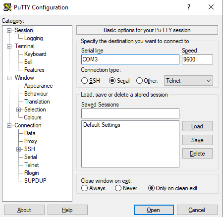
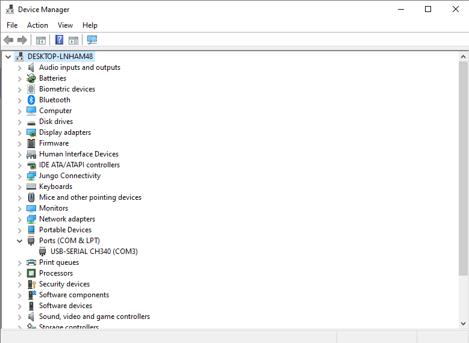

# UART Transmitter

подробнее про UART можно прочитать [здесь](https://www.analog.com/en/resources/analog-dialogue/articles/uart-a-hardware-communication-protocol.html).

На windows для приема можно использовать PuTTY. Надо выбрать serial и указать COM порт.

Узнать к какому COM порту следует подключиться можно в диспетчере устройств. Зайдите в диспетчер устройств и подразделом Ports (COM & LPT) найдите свое устройство. Если FPGA подключена, но устройство в данном разделе отсутствует, то установите драйвера. (Драйвера для USB-UART преобразователя указанного в мануале на плату)

После прошивки платы и открытия порта, в нем должно печататься сообщение отправляемое FPGA.
