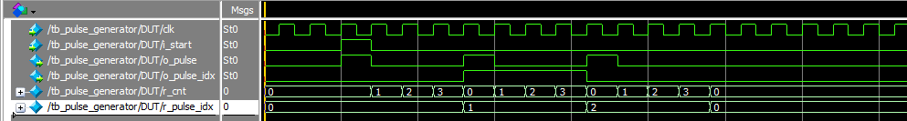

# Pulse generator

Схема которая по одному пришедшему импульсу генерирует P_PULSE_CNT импульсов с периодом P_CLK_PER_PULSE.
Входы: clk - тактовый сигнал, i_start - сигнал о начале. Выходы: o_pulse - вывод на котором после старта выводятся импулься, o_pulse_idx - индекс текущего импульса.  
Симуляция выглядит следующим образом
